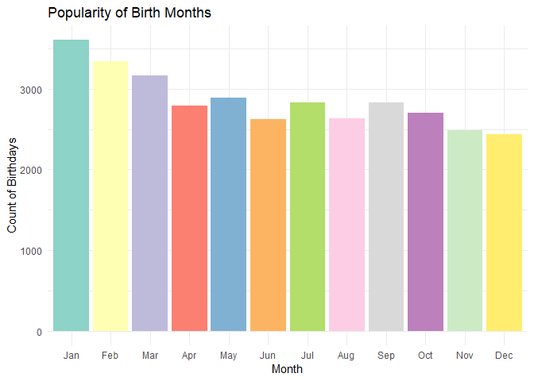
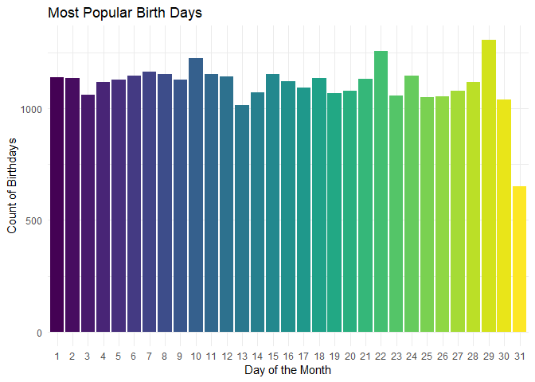
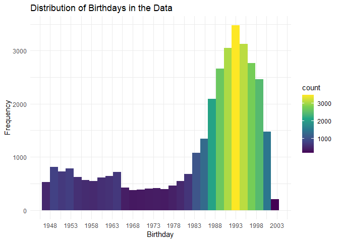
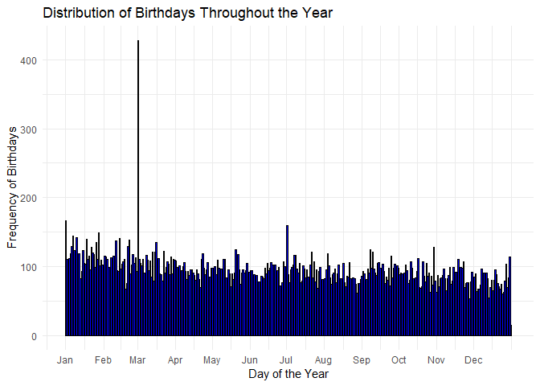
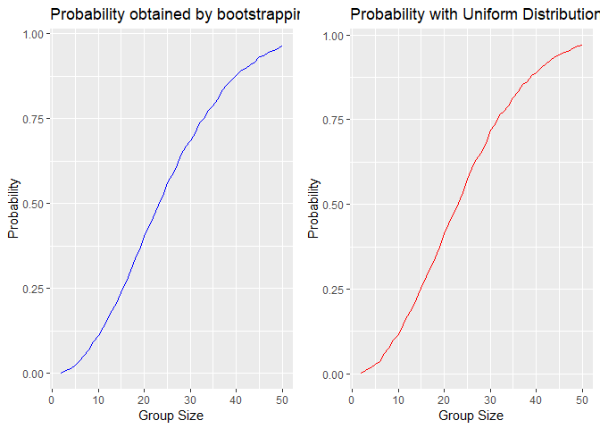

# Introduction

This document presents an analysis of the birthday paradox. The birthday
paradox concerns the probability that, in a set of randomly chosen
people, some pair of them will have the same birthday. We will explore
this probability through various visualizations and simulations.

# Library Loading

    library(dplyr)
    library(lubridate)
    library(ggplot2)
    library(reshape2)
    library(gridExtra)

# Clear the environment and set the working directory

    rm(list = ls())
    filepath <- rstudioapi::getSourceEditorContext()$path
    dirpath <- dirname(filepath)
    setwd(dirpath)

# Load and prepare the data

    data1= read.csv(file = 'Basic_Stats.csv')
    data2= read.csv('congress-terms.csv')
    data3 = read.csv("players_20.csv")

    prep_pipeline <- function(data1, data2, data3) {

      # Convert column names to lowercase
      names(data1) <- tolower(names(data1))
      names(data2) <- tolower(names(data2))
      names(data3) <- tolower(names(data3))

      
      data1$birthday = mdy(data1$birthday)
      data2$birthday = ymd(data2$birthday)
      data3$birthday = dmy(data3$birthday)
      
      # failed to parse = symbolize NA data points
      
      # Select 'birthday' column if it exists
      if ('birthday' %in% names(data1)) {
        data1 <- data1 %>% select(birthday)
      } else {
        stop('No birthday column found in data1')
      }
      
      if ('birthday' %in% names(data2)) {
        data2 <- data2 %>% select(birthday)
      } else {
        stop('No birthday column found in data2')
      }
      
      if ('birthday' %in% names(data3)) {
        data3 <- data3 %>% select(birthday)
      } else {
        stop('No birthday column found in data3')
      }
      summary(data3)
      
      # Merge the datasets row-wise
      merged_data <- bind_rows(data1, data2)
      merged_data <- bind_rows(merged_data , data3)
      
      # Remove NA dataset is representative
      merged_data = na.omit(merged_data)
      
      # Add an ID column
      merged_data <- merged_data %>% mutate(ID = row_number())
      
      
      merged_data <- merged_data %>%
        mutate(
          day = day(birthday),
          month = month(birthday),
          year = year(birthday)
        )
      
      
      
      merged_data <- merged_data  %>%
        filter(year >= 1947) # outliers 
      
      return(merged_data)
      
    }

    data = prep_pipeline(data1, data2 , data3)

    ## Warning: 3 failed to parse.

    rm(data1 , data2, data3)
    summary(data)

    ##     birthday                ID             day            month             year     
    ##  Min.   :1947-01-01   Min.   :    3   Min.   : 1.00   Min.   : 1.000   Min.   :1947  
    ##  1st Qu.:1974-12-24   1st Qu.:11552   1st Qu.: 8.00   1st Qu.: 3.000   1st Qu.:1974  
    ##  Median :1989-09-17   Median :36564   Median :16.00   Median : 6.000   Median :1989  
    ##  Mean   :1983-07-14   Mean   :30188   Mean   :15.75   Mean   : 6.147   Mean   :1983  
    ##  3rd Qu.:1994-10-09   3rd Qu.:45155   3rd Qu.:23.00   3rd Qu.: 9.000   3rd Qu.:1994  
    ##  Max.   :2002-08-08   Max.   :53745   Max.   :31.00   Max.   :12.000   Max.   :2002

# Plotting different aspects of the data

## Most popular birth month:

    data$month <- month(data$birthday, label = TRUE, abbr = TRUE)
    ggplot(data, aes(x = month)) +
      geom_bar(aes(fill = month)) +
      theme_minimal() +
      labs(title = "Popularity of Birth Months",
           x = "Month",
           y = "Count of Birthdays") +
      scale_fill_brewer(palette = "Set3") +  
      theme(legend.position = "none")  

## Most popular days to be born in the data:

    data$day <- factor(data$day)
    ggplot(data, aes(x = day)) +
      geom_bar(aes(fill = factor(day))) +  # Use day as a factor for different colors
      scale_fill_viridis_d() +  # Optional: A color scale that provides distinct colors
      theme_minimal() +
      labs(title = "Most Popular Birth Days",
           x = "Day of the Month",
           y = "Count of Birthdays") +
      theme(legend.position = "none")  # Removes the legend

## Birthday distribution in the data throught the years:

    ggplot(data, aes(x = birthday)) +
      geom_histogram(binwidth = 700, aes(fill = ..count..)) +
      scale_x_date(date_breaks = "5 years", date_labels = "%Y") + # Formatting x-axis
      theme_minimal() +
      labs(title = "Distribution of Birthdays in the Data",
           x = "Birthday",
           y = "Frequency") +
      scale_fill_viridis_c()  # Adds a color gradient

## Birthday distribution in the data throught the days in a year:

    data$day_of_year <- yday(data$birthday)

    # Generate breaks at the start of each month
    month_breaks <- yday(seq.Date(as.Date("2021-01-01"), as.Date("2021-12-31"), by = "month"))

    # Generate corresponding month labels
    month_labels <- month(seq.Date(as.Date("2021-01-01"), as.Date("2021-12-31"), by = "month"), 
                          label = TRUE, abbr = TRUE)

    ggplot(data, aes(x = day_of_year)) +
      geom_histogram(bins = 365, fill = "blue", color = "black") +
      scale_x_continuous(breaks = month_breaks, labels = month_labels) +
      theme_minimal() +
      labs(title = "Distribution of Birthdays Throughout the Year",
           x = "Day of the Year",
           y = "Frequency of Birthdays")

# Calculating the probabilities using samples of the data.

    # Define condition functions
    same_exact_date <- function(birthdays) {
      any(table(birthdays) >= 2)
    }

    same_month_year <- function(birthdays) {
      month_years <- paste(month(birthdays), year(birthdays), sep = "-")
      any(table(month_years) >= 2)
    }

    same_day_of_week <- function(birthdays) {
      weekdays <- wday(birthdays, label = TRUE)
      any(table(weekdays) >= 2)
    }

    # Modified run_simulation function to accept a condition function
    run_simulation <- function(data, group_size, num_simulations, condition_func) {
      successful_simulations <- 0
      
      for (i in 1:num_simulations) {
        sampled_birthdays <- sample(data$birthday, group_size, replace = TRUE)
        if (condition_func(sampled_birthdays)) {
          successful_simulations <- successful_simulations + 1
        }
      }
      
      probability = successful_simulations / num_simulations
      return(probability)
    }

    # Define a range of group sizes
    group_sizes <- 2:50

    # Run simulations for different conditions
    results <- expand.grid(Group_Size = group_sizes, Condition = c("Exact Date", "Month and Year"))
    # Corrected selection of condition functions
    results$Probability <- mapply(function(size, condition) {
      if (condition == "Exact Date") {
        condition_func <- same_exact_date
      } else if (condition == "Month and Year") {
        condition_func <- same_month_year
      } else {
        condition_func <- same_day_of_week
      }
      run_simulation(data, size, num_simulations = 10000, condition_func)
    }, results$Group_Size, results$Condition)

    # Reshape results for better readability
    results_wide <- dcast(results, Group_Size ~ Condition, value.var = "Probability")

    # View the results
    print(results_wide)

    ##    Group_Size Exact Date Month and Year
    ## 1           2     0.0000         0.0023
    ## 2           3     0.0006         0.0095
    ## 3           4     0.0012         0.0153
    ## 4           5     0.0020         0.0256
    ## 5           6     0.0023         0.0373
    ## 6           7     0.0035         0.0531
    ## 7           8     0.0045         0.0687
    ## 8           9     0.0046         0.0929
    ## 9          10     0.0064         0.1120
    ## 10         11     0.0080         0.1366
    ## 11         12     0.0111         0.1597
    ## 12         13     0.0120         0.1842
    ## 13         14     0.0147         0.2072
    ## 14         15     0.0184         0.2382
    ## 15         16     0.0167         0.2688
    ## 16         17     0.0236         0.3043
    ##  [ reached 'max' / getOption("max.print") -- omitted 33 rows ]

comments here :

# Calculating probabilities drawn from a uniform distribution.

    run_simulation_uniform <- function(group_size, num_simulations = 10000, min_shared = 2) {
      count_shared_birthday <- function(min_shared, birthdays) {
        any(table(birthdays) >= min_shared)
      }
      
      successful_simulations <- 0
      
      for (i in 1:num_simulations) {
        # Generate a uniform distribution of birthdays
        sampled_birthdays <- sample(1:365, group_size, replace = TRUE)
        if (count_shared_birthday(min_shared, sampled_birthdays)) {
          successful_simulations <- successful_simulations + 1
        }
      }
      
      probability = successful_simulations / num_simulations
      return(probability)
    }

    group_sizes <- 2:50  # From 2 to 50 people in the group

    # Run the simulation for each group size using mapply
    # mapply will apply the run_simulation_uniform function to each group size
    probabilities <- mapply(run_simulation_uniform, group_size = group_sizes, num_simulations = 10000)

    # Combine the group sizes with their corresponding probabilities into a data frame
    results <- data.frame(Group_Size = group_sizes, Probability = probabilities)

    # Print the results
    print(results)

    ##    Group_Size Probability
    ## 1           2      0.0031
    ## 2           3      0.0106
    ## 3           4      0.0171
    ## 4           5      0.0280
    ## 5           6      0.0374
    ## 6           7      0.0592
    ## 7           8      0.0769
    ## 8           9      0.1005
    ## 9          10      0.1148
    ## 10         11      0.1451
    ## 11         12      0.1706
    ## 12         13      0.1923
    ## 13         14      0.2201
    ## 14         15      0.2516
    ## 15         16      0.2856
    ## 16         17      0.3141
    ## 17         18      0.3412
    ## 18         19      0.3732
    ## 19         20      0.4143
    ## 20         21      0.4418
    ## 21         22      0.4686
    ## 22         23      0.5039
    ## 23         24      0.5334
    ## 24         25      0.5734
    ## 25         26      0.6051
    ##  [ reached 'max' / getOption("max.print") -- omitted 24 rows ]

    # Filter only the 'Month and Year' condition
    data_condition <- results_wide %>%
      select(Group_Size, `Month and Year`) %>%
      rename(Probability = `Month and Year`)

    # Plot for the 'Month and Year' condition from your data
    plot_data_condition <- ggplot(data_condition, aes(x = Group_Size, y = Probability)) +
      geom_line(color = "blue") +
      ggtitle("Probability obtained by bootstrapping") +
      xlab("Group Size") +
      ylab("Probability")

    # Plot for the uniform distribution
    plot_uniform_distribution <- ggplot(results, aes(x = Group_Size, y = Probability)) +
      geom_line(color = "red") +
      ggtitle("Probability with Uniform Distribution") +
      xlab("Group Size") +
      ylab("Probability")

    # Display plots side by side
    grid.arrange(plot_data_condition, plot_uniform_distribution, ncol = 2)

